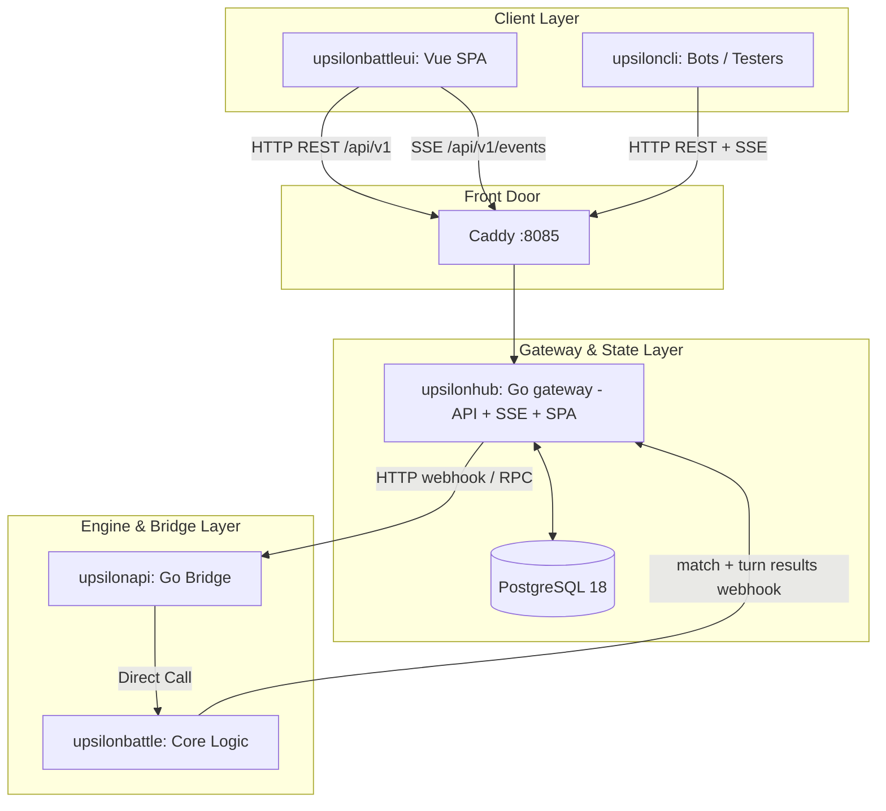

# Upsilon Hub: Architecture Anchor

**Date:** 2026-07-10
**Scope:** Global Project Architecture

> Reflects the post–Phase 6 cutover shape: the Go **hub** (`upsilonhub`) owns
> auth, matchmaking, economy, admin, the realtime SSE stream and the database
> schema, and serves the standalone Vue SPA. The former Laravel `battleui`
> (and Reverb WebSockets) are decommissioned.

## 1. System Overview

**UpsilonBattle** is a high-performance, turn-based Tactical RPG (TRPG) ecosystem designed for concurrent multiplayer combat and AI skirmishes. It operates on a multi-stack infrastructure, bridging a fast Go-based battle engine with a Go platform gateway (the **hub**), a standalone Vue.js SPA, and a Go testing/automation CLI.

The core philosophy of the system is absolute traceability, heavily utilizing the **Atomic Traceable Documentation (ATD)** framework to govern mechanics, network rules, and business requirements.

## 2. Component Architecture

The ecosystem consists of specialized micro-repositories (Git Submodules) working in unison:

| Service Component | Tech Stack | Responsibilities | Default Ports |
|---|---|---|---|
| **`upsilonhub`** | Go | Platform gateway. Auth/identity, session tokens, matchmaking, economy/loadout, admin, realtime **SSE** stream, DB schema + migrations/seed. Serves the REST API and the built SPA. | Hub: `8090`, front door (Caddy): `8085` |
| **`upsilonbattleui`** | Vue.js, Vite, Tailwind, TresJS | Standalone SPA (management UI + battle client). Talks to `/api/v1` with bearer tokens; listens on the SSE event stream. Built and served by the hub. | Vite dev: `5173` |
| **`upsilonapi`** | Go | The "Bridge". High-performance JSON API for the engine. Handles match state and engine callbacks. | API: `8081` |
| **`upsilonbattle`** | Go | The "Core Engine" (`BattleArena`). Calculates initiative, movement validation, damage, and combat state. | Embedded in `upsilonapi` |
| **`upsiloncli`** | Go | Interactive terminal, end-to-end (E2E) testing, and bot orchestration (goja JS scenarios). | N/A |

### 2.1 Shared Libraries
To enforce standard definitions across Go services, the following shared libraries are utilized:
- **`upsilontypes`**: Shared domain models, definitions, and types.
- **`upsilonserializer`**: Specialized Go serialization logic for the engine state.
- **`upsilonmapdata`**: Geometric board data structures and grid boundaries.
- **`upsilonmapmaker`**: Procedural generation tools for game maps.
- **`upsilontools`**: Shared utilities and mathematical helper functions.

## 3. Data Flow & Match Lifecycle

### 3.1 Flow Breakdown
1. **Match Creation**: Players (SPA) or bots (`upsiloncli`) request a match via the hub's matchmaking API, through the Caddy front door.
2. **Execution & Simulation**: The hub dispatches to the `upsilonapi` bridge, which drives `upsilonbattle`'s ephemeral `BattleArena` — the combat loop, initiative ticker (1-500), and action economy (Move/Attack/Pass/Delay costs).
3. **Broadcasting**: Live state (`match.found`, `game.started`, `turn.started`, board updates) is pushed to clients over the hub's **SSE** stream (`/api/v1/events`); the engine posts turn/board updates back to the hub via webhook.
4. **Resolution**: Upon elimination of a team (victory condition), the engine posts the final results to the hub for archiving and player progression tracking in PostgreSQL.

## 4. Engineering Standards & ATD Governance

The system enforces a **Zero Error Standard** audited by `scripts/code_health_check.py`.

### 4.1 Development Principles
- **Fail Fast & Crash Early**: Undefined behavior or silent failures are rejected in favor of explicit panics.
- **Zero Binary Commits**: Compiled outputs must be routed to `bin/` and gitignored.
- **API Envelope Strictness**: Communication layer protocols (`[[api_standard_envelope]]`) cannot be mutated without explicit documentation synchronization and approval.

### 4.2 ATD (Atomic Traceable Documentation)
All technical implementation MUST map to specific "Atoms" found in the `docs/` folder.
- **Rule of Traceability**: Every Go/JS source file must contain ATD links (`@spec-link`, `@test-link`) directly above relevant implementations; test files use `@test-link`.
- **Density Checks**: CI pipelines reject files missing ATD traceability, possessing excessive complexity (Nesting > 4), or exceeding length constraints (Warning: 400 LOC, Error: 600 LOC).

## 5. Deployment & Infrastructure

- **Local/CI Environment**: The ecosystem is containerized. `docker-compose.ci.yaml` orchestrates the ephemeral stack (`db` → `hub-migrate` → `hub-seed` → `hub` → `proxy` → `engine` → `tester`) for automated E2E tests; the local dev stack uses `docker-compose.yaml` (devcontainer + Caddy + Postgres 18). One hub image serves the API/SSE/SPA and runs migrations (`-migrate-mode`) and seeding (`-seed`).
- **Production**: `docker-compose.prod.yaml` runs `db` → `db-init` (`-migrate-mode full`) → `hub` → `proxy` (Caddy front door, host `8000` → `8085`) → `engine` → `cli`. Data persists in the `db_data` named volume.
- **Cloud (`upsilonaws`)**: Bash-based AWS provisioning deploying to `eu-west-3`. Uses a VPC, EC2 (`t3.medium`), RDS PostgreSQL 18 (`db.t3.micro`), Route 53 DNS, and an nginx proxy for SSL and routing.
