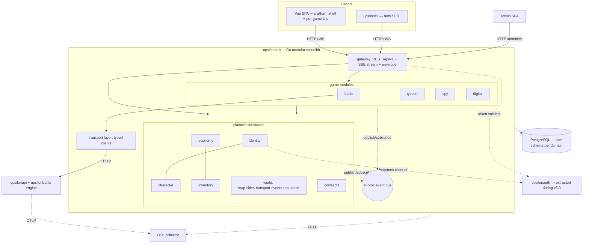

# Upsilon Platform v3.0 — Full Architecture Proposal

**Date:** 2026-07-04 · **Status:** v1 — Bastien's 2026-07-04 decisions are baked in (§10 is
the decision ledger; only the §10 "still open" items remain undecided)
**Scope:** the four-game platform, seeded — playable vertical slices of each game wired
through the shared world, not four finished games. **MQ is explicitly post-v3.0**; everything
here runs on HTTP + an in-process event bus, structured so the MQ swap later is bounded
(see `06_v3_platform_constraints.md` §2.1–2.2, which this doc builds on).

## 1. The four games and how they interlock

| Game | Player fantasy | Gives the world | Takes from the world |
|---|---|---|---|
| **Battle** (current TRPG) | Soldier/explorer | City defense, city founding, exploration of **the wild** | Arenas (city-hosted), gear (tycoon-made), digital effects |
| **Tycoon/Commerce** | CEO ruling cities | Resource extractors → factories → refined goods → **battle gear, city shielding** | Cities & infrastructure slots, spy protection, digital assistance |
| **Spycraft** | Spy for hire | Disruption/counter-espionage → **cities rise or fall** | Contracts from CEOs (assist or hinder), digital assistance |
| **Digital exploration** | Delver of the ruined precursor network | Monster capture, **effects unachievable otherwise** (mostly for battlers; also CEOs & spies) | Digital nodes discovered under cities / in the wild |

The interlock is the product: gear flows tycoon→battle, shields flow tycoon→city, disruption
flows spy→city, contracts flow CEO→spy, effects flow digital→everyone. **The architecture's
one central rule (§3) exists to make these flows possible without the four game codebases
touching each other.**

## 2. System topology (v3.0)

One platform process, external engines, one database. Same container count as post-migration.

- **`upsilonhub`** is the battleui-migration Go binary (doc 02) grown into the platform: it
  hosts the gateway, the platform substrates, and all four game modules. Modular monolith,
  extraction-ready seams — one process because we are pre-MQ and deployment stays one box.
- **The hub is the "landing".** Framing decision (Bastien, 2026-07-04): upsilonhub is the
  common entry point *between* the apps — account, characters, world overview, market,
  contracts, and navigation into each game. Game modules are tenants of the landing today and
  can become separate apps later without the landing changing role; the gateway + platform
  substrates *are* the product's front door, not battle's plumbing.
- **Authentication moves outside.** Identity/auth is extracted to a standalone service
  (working name `upsilonauth`) **during v3.0 seeding, not after** (Bastien, 2026-07-04) — it
  is the SSO seam every app (hub, future stand-alone game apps, admin) trusts: token
  issue/validate, accounts, GDPR, roles. The hub consumes it exactly along the
  `IdentityService` interface built in migration Phase 1, so this is the planned Phase 7
  pulled forward (see §9).
- **Engines stay external when compute-heavy.** `upsilonbattle` (via `upsilonapi`) is the
  only engine today. Tycoon and spy are tick-and-database simulations — they live inside the
  hub. Digital exploration's combat (if it has real-time combat) should **reuse the battle
  engine** with monster entities rather than spawn a new engine — flagged as open question §10.
- **Extraction path unchanged:** identity → economy → character remain the planned peel-offs
  (migration Phases 7/8/9); `world` becomes a fourth candidate once cross-game load exists.
  Post-v3.0, the event bus becomes the MQ and game modules become services if needed.

## 3. The composition rule (the load-bearing decision)

> **Game modules never import each other. All cross-game influence flows through platform
> state, shared vocabularies, or events.**

Concretely, each flow from §1 is expressed *without* game-to-game calls:

| Flow | Mechanism |
|---|---|
| Tycoon gear → battle | Tycoon crafts an **item** (platform inventory) whose **effects** battle interprets when equipped. Tycoon knows nothing of battle rules; battle knows nothing of factories. |
| Tycoon shield → city defense | Shield generator is **city infrastructure** (world-owned). Battle's siege resolution reads the city's shield state from `world`, not from tycoon. |
| Spy disruption → city rise/fall | Spy op publishes an **event** (`spy.operation_executed`); `world` applies the stability delta on its tick. Spy never writes city rows. |
| CEO ↔ spy dealings | A **contract** (platform domain): offer, escrowed payment (economy), objective, completion driven by events. Works for CEO→battler ("defend my city") and →digital expert too. |
| Digital explorer → battle support | A **contract** attaches a digital explorer to a battle team; battle resolves their **external skills** (hijack foe weapon systems, hack defenses/comms, bypass scenery for alternative paths/rooms/secrets) via the effects vocabulary — own cooldowns, no battler-side cost, usage limits set by the contract. High value in **city defense and wild exploration** (foes largely robotic; the ruins' tech remnants are hackable), marginal in arena fights. The reverse flows too: accompanying battlers gets the explorer to remote wild computers hosting wilder programs — mediated by world/expedition access, never by game-to-game calls. |
| Battle founds/defends city | Battle publishes `battle.city_founded` / `battle.city_defense_resolved`; `world` mutates the map/city state in response. |

Enforcement is cheap and mechanical: an import-boundary lint (`internal/games/x` may import
`internal/platform/*` and `upsilontypes`, never `internal/games/y`) wired into
`code_health_check.py`, plus one ATD CONTRACT atom stating the rule.

## 4. Domain map & ownership

### Platform substrates (`internal/platform/…`)

| Domain | Owns | Notes |
|---|---|---|
| **identity** | accounts, auth tokens, GDPR, `ws_channel_key`, roles | As per migration doc 02 Phase 1 — but **extraction is now scheduled inside v3.0** (§2, §9): becomes the standalone `upsilonauth` SSO service; the in-hub package shrinks to a client of it. |
| **character** | character core: name, owner, **world location**, portrait/flavor | Thin on purpose. Per-game state lives in game-owned **profiles** (§6). Extraction candidate #3. |
| **economy** | wallet (credits), ledger, **market** (listings, settlement) | Migration doc 02 Phase 5/8 scope + market grows to carry tycoon goods. Extraction candidate #2. |
| **inventory** | possession of item instances; item-type **registry** | Registry = the shared item vocabulary (§5.1). Resources, components, gear, programs, monsters are all item instances with domain-typed payloads. |
| **world** | map (colonized regions + **the wild** + **digital nodes**), cities (infrastructure slots, **stability**, control, shield state), transport (routes, travel, presence), **world events**, **reputation** | The spine. Runs the **world tick** (goroutine now, worker later). |
| **contracts** | offers, acceptance, escrow refs, typed objectives, status machine | Generic across games; completion conditions are event subscriptions. |

### Game modules (`internal/games/…`)

| Module | Owns | Seed scope in v3.0 (§7) |
|---|---|---|
| **battle** | everything battleui owns today post-migration: matchmaking (queue **scoped by arena**), match lifecycle, battle profiles (the v2 stat block), equipment/skills loadout, engine bridge | City-arena queues; wild expedition matches; city-defense matches; founding expeditions |
| **tycoon** | buildings owned by players (extractor, factory), production recipes, **idle state** (rates, lazy accrual, thresholds), holdings | Build extractor/factory in a city slot; idle production chain resource→component→gear; threshold-triggered caravan; sell on market |
| **spy** | operations catalog, **narrative graph state** (arcs, beats, time windows), execution (success roll, cooldowns, exposure), spy profile | Take a CEO contract as a short narrative arc; run one disruption op and one counter-espionage op against a city |
| **digital** | **its own game system — "à la Pokémon", explicitly *not* the battle engine**: digital nodes as explorable systems (SSH-terminal / file-tree presentation), wild **live programs** (aggressive or not), capture resolution, captured-program roster with **hacking toolkits**, external-skill support kit | Explore one node terminal-style; encounter and capture a wild program; fulfill one support contract granting an external skill in a wild/defense battle |

### Common admin backend (cross-cutting)

One admin surface for all systems (Bastien, 2026-07-04), replacing battleui's in-app admin:

- **One admin API** under the gateway (`/admin/v1/*`), authenticated against `upsilonauth`
  roles (today's `admin` middleware generalizes to role claims from the auth service).
- **Each domain ships an admin facet** — a small, explicit interface the admin API composes:
  identity (users, anonymize — today's admin), economy (ledgers, market oversight), inventory
  (item-type registry CRUD — supersedes today's skill-template/shop-item admin), world
  (cities, stability, event injection — also the designer's world-editing tool), contracts,
  and per-game facets (battle history/purge as today; tycoon recipes; spy op catalog; digital
  node/monster tables). Facets live with their domains; the admin API is composition, not a
  second copy of domain logic.
- **One admin frontend**, separate from the player SPA (the current 3 admin Inertia pages are
  already the odd ones out — migration doc 02 §3 option 2 removes their Inertia coupling, so
  they land naturally in a standalone lightweight admin SPA talking to `/admin/v1`).
- Extraction note: because facets are interfaces, the admin API can later move out of the hub
  (or stay as a landing responsibility — recommended: **it stays**; the landing is the natural
  home for the platform's back office).

## 5. Shared vocabularies (in `upsilontypes` when cross-process, else `internal/platform`)

These three vocabularies are what let four games compose. They are the highest-leverage design
surfaces in v3.0 — spec them as ATD CONTRACT atoms before coding.

### 5.1 Item registry
Item **types** are registered with: id, domain tag (`resource | component | gear | consumable
| program | blueprint`), display data, and an optional **effects list** (5.2).
Item **instances** live in inventory with owner + type + instance payload (e.g. a gear's
quality tier). Today's `shop_items`/`player_inventories` migrate into this; the current shop
becomes one market vendor. **Captured programs ("monsters") are digital-game entities**, not
inventory items (resolved 2026-07-04): they live in the digital module's roster with their
hacking toolkits; whether a tradable representation ever surfaces in inventory is a digital-
domain choice later.

### 5.2 Effects
A typed descriptor: `{domain, kind, magnitude, duration, source}` — e.g.
`{battle, stat_mod, …}`, `{battle, action_unlock, overclock}`, `{world, city_shield, 3}`,
`{tycoon, production_boost, …}`. **Producers** (tycoon crafting, digital capture) attach
effects to items/infrastructure; **consumers** (battle engine, world tick, tycoon jobs)
resolve only kinds addressed to their domain. Kinds are a closed registry validated at
creation (crash-early: an unregistered kind is rejected when content is authored, not
tolerated downstream). The battle engine already has the skills/channeling machinery —
battle-domain effects should compile onto that machinery, not a parallel one.

### 5.3 Domain events
Envelope: `{event_id (UUIDv7), type, occurred_at, actor, subject, payload, request_id/traceparent}`.
Seed catalog: `battle.match_concluded`, `battle.city_defense_resolved`, `battle.city_founded`,
`battle.wild_explored` · `tycoon.building_constructed`, `tycoon.production_completed`,
`tycoon.item_crafted` · `spy.operation_executed`, `spy.contract_fulfilled` ·
`digital.expedition_completed`, `digital.monster_captured` · `world.city_stability_changed`,
`world.transport_arrived`, `world.event_triggered` · `economy.settled` ·
`contracts.offered/accepted/completed/breached`.
Delivered on the in-process bus; consumers must be **idempotent on `event_id`** — the
discipline that makes the post-v3.0 MQ swap a dispatcher change (doc 06 §2.1).

## 6. Character model (RESOLVED 2026-07-04 — Bastien's rulings replace the earlier proposal)

**One account → N characters; each character belongs to exactly one game; the *player* holds
the world location.**

- **Location is player-level.** A player occupies **one active city node** (or
  transit/wild/digital context); when the player moves, **all their characters move
  together**. No per-character positions. This holds even for CEOs: a CEO controlling several
  cities must be *present* in one of them to enact certain changes there.
- `character` (platform core): identity link, name, **game affiliation**
  (battler | CEO | spy | digital explorer), reputation scores. Game-specific data (v2 stat
  block, holdings, op skills, program roster/toolkits) is owned by that game's module, keyed
  by character UUID.
- **No cross-game characters.** A battler only battles; a CEO is never called to the front;
  a spy stays a spy. The **single exception is the digital explorer**, who may accompany
  battle teams (external-skill support, §3) and may be contracted by spies. Their in-battle
  presence model — active participant vs. spectator who acts on triggered events — is **to be
  fleshed out** (§10 open).
- Migration consequence: port `characters` as-is (Phases 0–6 untouched); the V3-1b split puts
  **location on the player row**, game affiliation on the character core, and today's v2 stat
  block into the battle module's data. This is exactly the split `CharacterService`
  (doc 06 §2.3) was built to absorb.

## 7. The world spine (what `world` actually does)

- **Map:** colonized regions containing cities; **the wild** beyond them (target of battle
  exploration; founding a city converts a wild site); **digital nodes** discovered under
  cities and in the wild (the precursor-ruins layer digital expeditions enter).
- **Cities:** infrastructure **slots** filled by buildings (arena — hosts battle queues;
  extractor/factory — tycoon; shield generator — consumes tycoon-crafted shielding;
  more later). **Stability** (the "order" spies disrupt): a scalar moved by events
  (spy ops, defenses won/lost, world events) on the world tick; thresholds trigger
  rise/fall consequences (slot unlocks, control changes, event spawns).
  **Control:** which CEO(s) rule the city — tycoon gameplay, world-recorded.
- **Transport & presence (RESOLVED 2026-07-04):** routes between cities with travel time;
  **location is per-player** — all of a player's characters move together, one active city
  node (§6). Presence gates activity: arena fights require being in a city **with an arena
  building**; CEOs must be present in a controlled city to enact certain changes. Inter-city
  *communication* is limited and depends on city **tiering** — that design is deferred (§10),
  but the world model should assume "information does not travel freely" from the start.
- **Reputation:** event-sourced scores per `(character, scope)` where scope = city or global.
  Seed: adjust on defenses, contracts, disruptions (exposed spies lose city reputation).
### Time architecture (one clock, two mechanisms — replaces the naive "world tick")

The games have different temporal profiles on **one shared world clock** (Bastien,
2026-07-04): tycoon is **idle** (extraction/production at rates, caravans on thresholds),
spy is **narrative with event-bound activities on the same clock**, battle and digital are
**session-based and freer**. A per-entity tick cannot serve the idle game (ticking every
factory every second doesn't scale and drifts); instead:

- **The world clock** is a tiny injected package (`now()` + speed multiplier), the single
  time authority for every domain. Runs 1:1 with real time in production; **accelerated /
  fake in tests and CI** — idle and narrative mechanics are E2E-untestable otherwise. No
  domain ever calls `time.Now()` directly.
- **Lazy accrual** for continuous rates (extractors, factories): store
  `(rate, last_settled_at, storage_cap)` and settle on read or interaction. Caps bound
  offline accrual; nothing ticks while nobody looks.
- **Durable scheduled events** for discrete moments: caravan departures (the threshold
  crossing time is *computed analytically* from current rates and scheduled as a job;
  rate changes reschedule it), transport arrivals, spy narrative windows/beats, stability
  checkpoints, world-event spawns. Backed by a transactional Postgres job queue (§13) —
  survives restarts, needs no broker, and is the natural pre-MQ workhorse.
- Battle and digital sessions run on their own pace but **stamp world time** on their
  outcomes, so contracts, reputation, and world events sequence correctly across games.

## 8. Data architecture

> **Amendment (2026-07-22) — superseded in part.** Extracted services get their **own
> database**, not a shared-instance schema: `upsilon` (hub), `upsilonauth`, `upsiloneconomy` —
> one database per service on the shared Postgres instance, each with its own
> `DATABASE_URL`, relocatable to a dedicated instance later with no SQL changes (see
> `how_to_add_a_service.md` §4). This *strengthens* the same discipline stated below rather
> than replacing it: cross-service references remain **UUID-only**, no cross-service foreign
> keys or joins, ownership checks still go through the owning interface — the boundary is just
> physically harder (a different database, not just a different schema in one database) and
> the extraction unit is now a database, not a schema. **"One schema per domain" remains the
> intra-hub discipline** for domains not yet extracted (character, inventory, world,
> contracts, and the game modules) — read the original text below with that scope narrowed
> to "still inside `upsilonhub`".

**One PostgreSQL, one schema per domain** (`identity.*`, `character.*`, `economy.*`,
`inventory.*`, `world.*`, `contracts.*`, `battle.*`, `tycoon.*`, `spy.*`, `digital.*`).

- Cross-schema references are **by UUID only — no cross-schema foreign keys or joins** across
  extraction seams; ownership checks go through the owning domain's interface. This is doc 06's
  discipline made physical: extracting a service = moving a schema + swapping an interface impl.
- Migration Phases 0–6 keep today's flat schema; **V3-1b (below) is the re-homing step**
  (e.g. `users`→`identity`, `characters` split into `character` + `battle`,
  `shop_items`/`player_inventories`→`inventory`+`economy`, queue gains arena scope).
- sqlc per schema; each domain package owns its queries. JSONB where state is engine-shaped
  (as today for `game_state_cache`), typed columns where the platform reasons about the data
  (stability, locations, ledger).

## 9. Delivery plan

**Stage 1 — finish the battleui migration exactly as scoped** (doc 02 Phases 0–6), with one
amendment: lay the package tree out as `internal/platform/*` + `internal/games/battle/*` +
`internal/gateway` + `internal/transport` + `internal/events` from Phase 0, so v3.0 seeding is
additive. (Doc 02's layout section already points this direction; this doc supersedes it on
naming.) **Identity extraction (Phase 7) is pulled into v3.0** as step V3-1a below — auth
becomes the external SSO service the landing and all future apps share. Economy extraction
(Phase 8) still slides past v3.0; its seam is what matters.

**Stage 2 — v3.0 seeding**, one vertical slice at a time, each ending ATD-green and
Playwright/CLI-testable:

| Step | Delivers | Why this order |
|---|---|---|
| **V3-0 Vocabularies** | Item registry, effects registry, event envelope + bus, contracts skeleton; **admin API backbone** (`/admin/v1` + facet interface, porting today's admin as the identity/battle facets). ATD CONTRACT atoms first. | Everything else speaks these; every later step ships its admin facet into an existing frame. |
| **V3-1a Auth extraction** | `upsilonauth` standalone service (accounts, tokens, GDPR, roles); hub's identity package becomes its client; admin/player auth both validate against it. Re-run auth/GDPR/renewal suites across the service boundary (doc 02 Phase 7 content, resequenced). | The SSO seam everything else — landing, admin, future game apps — trusts. |
| **V3-1b Character & schema split** | Character core (game affiliation) vs battle game data; **player-level location** (single default city to start); schema-per-domain re-homing. | Platform substrate before world features. |
| **V3-2 World spine** | Map with a handful of cities + wild sites + digital nodes; transport & presence; stability; world tick; reputation skeleton. City arenas replace the global queue (scope = arena). | The spine everything plugs into. |
| **V3-3 Tycoon seed** | City slots, extractor + factory, one recipe chain ending in **battle-usable gear** and **city shielding**; lazy accrual + first threshold-triggered caravan (proves the time architecture §7); market listing. | First cross-game artifact proves the item/effect vocabulary — and the idle clock. |
| **V3-4 Battle world hooks** | Wild expedition matches, city-defense matches (reading shield state), founding expeditions. | Consumes tycoon output; produces world change. |
| **V3-5 Spy seed + contracts live** | CEO→spy contract flow with escrow; one contract arc as a **narrative graph** with time-windowed beats; one disruption op + one counter-op moving stability. | Needs cities worth disrupting (V3-2/3), contracts (V3-0), and the scheduler (V3-3 proved it). |
| **V3-6 Digital seed** | Terminal-style exploration of one digital node (file-tree/SSH presentation); encounter + capture a wild program into the digital roster; one support contract granting an **external skill** (own cooldown, contract-limited) in a wild/defense battle, resolved through the effects vocabulary on the engine's skill machinery. | Assists the others; lands last, leans on everything. |

## 10. Decision ledger

### Resolved (Bastien, 2026-07-04)

1. **Realtime transport: SSE** — client requests stay REST; only server-push events need a
   stream (migration doc 03, with implementation notes).
2. **DB layer: pgx + sqlc + golang-migrate** — no ORM.
3. **Tokens: opaque** + short-lived validation cache once `upsilonauth` is external.
4. **Presence gating: yes** — player-level location, all of a player's characters move
   together, one active city node; arena fights require a city with an arena building; CEOs
   must be present in a controlled city for certain actions (§6, §7).
5. **Digital exploration is its own game system** — "à la Pokémon", not the battle engine:
   terminal/file-tree exploration of digital nodes, wild live programs (aggressive or not),
   capture into a digital roster with hacking toolkits; the wider network comes later (§4).
6. **Captured programs are digital-game entities**, not inventory items (§5.1).
7. **Digital ↔ battle interaction = contracted external skills** — own cooldowns, no
   battler-side cost, contract-limited; strong in city defense / wild exploration (robotic
   foes, hackable ruins scenery → alternative paths/rooms/secrets), marginal in arenas; the
   alliance also grants explorers access to remote wild computers (§3).
8. **Characters: multiple per account, exactly one game each** — digital explorers are the
   only cross-front participants (§6).
9. **Narrative authoring: hand-authored YAML/JSON graphs** for the seed; Ink/Twine compile
   step to be explored later — the graph format must not preclude it (§13.2).
10. **Repo restructure (§14): settled as written**, with three refinements — all upsilon
    repos flipped **private**; the Vue SPA move out of battleui is **deferred to Phase 3+**
    (Phase 0 is Go-only, avoids forking the SPA while Laravel still serves it); the umbrella
    repo renamed **`upsilonumbrella`** (was `upsilon-hub`) to avoid the near-collision with
    the new `upsilonhub` Go repo. `ecumeurs/upsilonhub` created private, seeded
    (`module github.com/ecumeurs/upsilonhub`), added as submodule, wired into `go.work` and
    `.atd.workspace`.

### Still open

1. **Market subsumes shop** — "probably" (Bastien); finalize when V3-3 nears.
2. **Digital explorer's in-battle presence model** — active participant vs. spectator acting
   only on triggered events; flesh out before V3-6 (and before the battle engine grows any
   support-slot concept).
3. **City tiering & inter-city communication limits** — deferred design; world model assumes
   information does not travel freely.
4. **Onboarding friction under presence gating** — starting city, first travel experience.

## 11. ATD & governance

- New top-level atoms before V3-0 code: `vision_platform_v3`, `contract_game_composition`
  (the §3 rule), `contract_item_registry`, `contract_effects`, `contract_domain_events`,
  `contract_character_profiles`, plus per-domain VISION atoms (`vision_world`,
  `vision_tycoon`, …). Each seed step follows the ATD lifecycle (Discovery → Specification →
  Implementation → Verification) per `.agent/rules/ATD.md`.
- ATD project registration: `upsilonhub` becomes the registered project (migration doc 05
  Task 2); platform-domain atoms live with it. Whether each game module later becomes its own
  ATD project can wait until a module leaves the monolith.
- The §3 import-boundary rule goes into `code_health_check.py` alongside the existing
  zero-error checks.

## 12. What this doc deliberately does not do

- **No MQ, no broker** — post-v3.0 (per Bastien, 2026-07-04). The bus/idempotency/traceparent
  disciplines are the preparation.
- **No progression-layer design** — "layers of progression" are flagged TBD; the profile and
  reputation structures are where they will attach.
- **No balancing/content design** — recipes, ops, monster tables are content, not
  architecture; the registries are their container.
- **No new frontend architecture** — the SPA grows per-game views behind the existing
  gateway; a frontend study is warranted around V3-2 when world UI (map/travel) appears.

## 13. Technology stack proposal

### 13.1 Language policy

**Go for every service** — hub/landing, `upsilonauth`, engines, workers. One toolchain,
shared `upsilontypes`, goroutines fit the WS-hub + scheduler workload, one deploy story.
Languages considered for a significant edge, and the verdict:

| Candidate | Would bring | Verdict |
|---|---|---|
| **Elixir/OTP** | Superb stateful world simulation, supervision trees | Real edge only at massive concurrent-world scale; splits the stack, duplicates `upsilontypes`. **No.** |
| **C# / game engines** | Ink-native narrative tooling, rich client engines | Only relevant if a game ships a heavy standalone client one day. **Not now.** |
| **TypeScript (server)** | Isomorphic types with the SPA | Nothing Go doesn't already cover; frontend stays TS regardless. **No.** |
| **Python** | Fast modeling/simulation | **Yes, tooling-only**: an offline idle-economy balance simulator (rates, thresholds, market flows) before V3-3, next to the existing Python CLI tooling. Never in the serving path. |

### 13.2 Server libraries (extends migration doc 02's table — Gin, pgx+sqlc,
golang-migrate, coder/websocket, go-playground/validator, OTel, testify+testcontainers all stand)

| Concern | Proposal | Rationale |
|---|---|---|
| Durable scheduled events & background jobs | **`riverqueue/river`** | Postgres-backed job queue with **transactional enqueue** — a caravan job is scheduled in the *same tx* as the stock settlement, so clock state can't desync from domain state. No new infra, survives restarts, and is the pre-MQ workhorse (§7). Replaces hand-rolling the `jobs` table Laravel is leaving behind. |
| World clock | Hand-built `worldclock` package (or `benbjohnson/clock` as the interface) | ~50 LOC; injected everywhere; fake/accelerated in tests. Too central to outsource. |
| In-process event bus | **Hand-built** typed dispatcher (~100 LOC) | Deliberately ours: it is the future MQ seam (doc 06 §2.2); a lib's semantics would leak into it. |
| Economy & idle math | `int64` base units for credits/resources; **`shopspring/decimal`** only where fractional rates are unavoidable | Idle games accumulate for days — `float64` drift is a guaranteed bug class. Ledger stays integer. |
| Data-driven content (recipes, ops, item/effect defs) | YAML/JSON files validated at boot (crash-early), types in Go; optionally **`expr-lang/expr`** for rate/condition formulas | Balancing without recompiling; `expr` is sandboxed and typed. Hand-rolled loading is fine — the *validation at boot* is the non-negotiable part. |
| Spy narrative engine | **Hand-built narrative graph** (nodes, requirements, effects, time windows) with content as data | Go runtimes for Ink are immature, and running inkjs client-side would hand narrative authority to the client. Event-bound activities (not deep branching prose) fit a graph we own. Authoring in Ink/Twine with a compile step stays possible later — open question #7. |
| Auth (`upsilonauth`) | `x/crypto` **argon2id**, custom opaque tokens (§10 Q6) | Same stack, small service. Adopt an OIDC provider (Zitadel/Ory) **only if** third-party clients ever appear — don't hand-build OIDC, don't run one speculatively. |
| Inter-service resilience (hub↔auth↔engine) | Thin hand-rolled retry/timeout/circuit wrapper in `internal/transport` (or `failsafe-go` if it grows) | Three internal HTTP edges don't justify a mesh. |

### 13.3 Frontend

Unchanged stack, wider surface: **Vue 3 + Vite + Pinia + Tailwind**, TresJS/Three.js for the
battle arena. Tycoon (idle dashboards), spy (narrative UI), digital, and the world map are
views in the landing SPA; the **admin SPA is a second, minimal Vue app** on `/admin/v1` (§4).
Realtime client: a small `EventSource` wrapper (SSE — resolved, doc 03) keeping the
composables' listen API. The world map likely wants plain SVG / canvas before any heavier
mapping tech — revisit at the V3-2 frontend study (§12). The digital game's UI is
**terminal-flavored** (SSH/file-tree presentation): plan on **xterm.js** (or a styled fake
terminal component if full emulation is overkill) when V3-6 nears.

### 13.4 upsiloncli — the almost-E2E harness for every front

Expectation (Bastien, 2026-07-04): upsiloncli grows from battleui scripting into a client of
**all** platform and game APIs — world, tycoon, spy, digital, contracts, economy, admin —
enabling almost-E2E testing (everything but the frontend) across the whole platform.

- **Structure it as one client per domain/API group**, mirroring the gateway's route groups,
  not one monolithic client — so each V3 seed step ships its CLI client alongside its API,
  and cross-game journeys (CEO crafts gear → battler equips it → defends city → spy disrupts)
  become scriptable scenarios.
- **Generate, don't hand-write, the clients:** the Go gateway should publish an **OpenAPI
  spec per route group** (battleui's `/v1/help` self-documentation grows into this), and
  upsiloncli generates its clients from it. Keeps CLI/hub drift structurally impossible and
  gives future tools the same contract for free.
- **The accelerated world clock (§7) must be reachable from the CLI** in test environments —
  idle accrual and narrative time-window journeys are untestable at 1:1 time. A test-only
  admin facet ("advance clock", "trigger scheduled job now") is part of the V3-0 backbone.
- During the battleui migration, the CLI's existing scripting is a free acceptance gate: it
  must stay green across the PHP→Go cutover without modification (doc 02 §6, lever e).

### 13.5 The build-vs-buy line

Buy at the **infrastructure layer** (DB driver, queue, telemetry, crypto). Build the **game
machinery** by hand (event bus, effects resolution, narrative graph, world clock, contracts
state machine) — these encode the product's rules, are small in Go, and per Bastien "we will
build all this by hand if need be" is an accepted cost.

## 14. Repository & project-tree restructure (SETTLED 2026-07-04 — see §10 Resolved #10)

Settled as written below, with refinements: all upsilon repos private; SPA move deferred to
Phase 3+; umbrella renamed `upsilonumbrella`. `ecumeurs/upsilonhub` exists and is wired in.
The table as approved:

| Repo | Content | Fate |
|---|---|---|
| **`upsilonhub`** (new) | The Go platform/landing: gateway, platform domains, game modules — plus the Vue SPA and admin SPA initially (moved out of battleui) | Created at Phase 0; becomes the registered ATD project (doc 05 Task 2, rename decided) |
| **`upsilonauth`** (new) | Extracted identity/auth service | Created at V3-1a; the seam exists from migration Phase 1 |
| `battleui` | Laravel + Vue today | Vue app migrates into `upsilonhub`; repo archived at Phase 6 cutover |
| `upsilonapi`, `upsilonbattle`, `upsilontypes`, `upsilonserializer`, `upsilonmapdata`, `upsilonmapmaker`, `upsilontools`, `upsilonaws` | Unchanged roles | Stay as-is; `upsilontypes` gains the shared contract structs (§5) |
| `upsiloncli` | Scripting/E2E harness | Stays; grows per-domain generated clients (§13.4) |
| **`upsilon-hub`** (this umbrella) | Submodule aggregator, `go.work`, `.atd.workspace`, `architecture/`, issues | Stays the umbrella; gains the `upsilonhub` submodule |

Splitting the frontend into its own repo is possible later; keeping it inside `upsilonhub`
minimizes moving parts during the migration. Whether per-game modules ever get their own
repos is a post-extraction question, not a v3.0 one.
