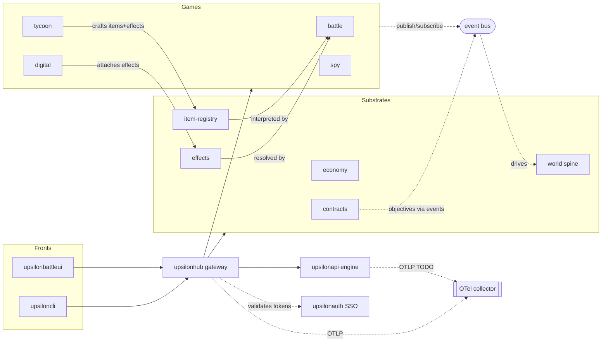

# v3 Platform — Service Map

> **Purpose:** the anti-getting-lost index for a wide multi-service platform. For any service,
> this says: which **project** owns it, its **current home** vs **target home**, the single
> **CONTRACT + VISION** that governs it (one pair per project — see the governance rule below),
> whether it is a **bridge** between projects, and its **OTel** instrumentation status.
>
> **Status:** living reference, created 2026-07-22. Derived from
> [`v3_platform_architecture.md`](v3_platform_architecture.md) plus Bastien's 2026-07-22 direction
> (many services will spawn, each with its own contract/vision; effects is one project).
> Provenance is tagged per row: **[arch]** = in the approved architecture; **[2026-07-22]** =
> new candidate from that direction, not yet in the delivery plan.

## Governance rule (load-bearing)

**One CONTRACT atom + one VISION atom per project.** Not size-constrained; must be settled
**before** any business-layer atom (REQUIREMENT/MECHANIC/…) of that project is altered. A project
never holds `contract_x` + `contract_y`; if two things need separate contracts, they are two
projects. This is exactly why this map exists **before** the V3-0 atom work: the project
boundaries below decide where each single contract/vision lands.

## Legend

- **Project** = an ownership+deploy boundary that is (or will become) its own repo/ATD project,
  carrying its own single contract+vision.
- **Home:** `pkg:<repo>/<path>` = a package inside an existing repo (a *logical* service, not yet
  its own project); `repo:<name>` = its own repository/deployable.
- **Bridge** = a service whose role is to mediate between projects (trust seam, vocabulary shared
  by producer+consumer projects, or facet aggregator). Bridges are where cross-project coupling is
  *allowed* to live — everything else must route through them.

---

## 1. Existing repos / projects (today)

| Project | Home | Role | Bridge? | OTel |
|---|---|---|---|---|
| **upsilonhub** | `repo:upsilonhub` | Go platform gateway + landing: hosts all platform substrates and game modules as packages today; serves REST `/api/v1`, SSE stream, admin, DB schema, and the built SPA. | Yes — gateway bridges SPA/CLI ↔ engine ↔ DB | ✅ instrumented (otelgin/otelpgx/OTLP) |
| **upsilonapi** | `repo:upsilonapi` | The battle **engine** bridge: high-performance JSON API for match state + engine callbacks. | Yes — bridges hub ↔ battle simulation | ❌ **not instrumented** (design exists, doc 04) |
| **upsilonbattleui** | `repo:upsilonbattleui` | Standalone Vue SPA (player + battle client) + the admin pages; talks to `/api/v1`, listens on SSE. | No | n/a (browser) |
| **upsiloncli** | `repo:upsiloncli` | Go scripting/automation harness — the almost-E2E driver for every front. | No (test-time) | ❌ not instrumented |
| **upsilonbattle** | `repo:upsilonbattle` | Battle domain rules/content (ATD + Go). | No | ❌ n/a today |
| **upsilontypes** | `repo:upsilontypes` | Cross-process shared vocabularies (where types cross a service boundary). | Medium — shared vocabulary carrier | n/a (lib) |
| upsilonmapdata / upsilonmapmaker / upsilontools / upsilonaws | `repo:*` | Map content, map tooling, dev tooling, infra. | No | ❌ n/a |
| **upsilonplatform** | `repo:upsilonplatform` | Shared mechanical kit extracted **verbatim** from `upsilonhub` on 2026-07-22: `respond` (envelope), `clock`, `observability`, `database`, `jobs` (River wrapper), plus new `httpx` (S2S client — traceparent, `X-Internal-Token`, `X-Request-ID`). Every new service composes on it; **copy nothing** — parity across serving processes can't survive copy-drift. | Medium — mechanical carrier every extracted service depends on, not a domain seam | n/a (lib); every service built on it is born OTel-instrumented (§7) |

## 2. Platform substrate services (`internal/platform/…` today)

These are the cross-cutting substrates. Each is an **extraction candidate**; the seam to pull it
out was built during the migration (in-process call → network call is an impl swap, not a rewrite).

| Service | Owning project (target) | Home now | Target | Bridge? | Contract/Vision | Provenance |
|---|---|---|---|---|---|---|
| **identity / auth** | **upsilonauth** | `repo:upsilonauth` (scaffold phase, dark — not yet routed) + `pkg:upsilonhub/internal/platform/identity` (still authoritative until the Phase 4 client swap + Caddy cutover) | `repo:upsilonauth` (SSO) — hub becomes a client | **Yes — trust seam every service validates tokens against** | `contract_auth_service` + `vision_auth` — **settled** | **[2026-07-22] extraction IN PROGRESS** — repo exists (submodule wired), Phase 1 scaffold underway; supersedes "[arch] V3-1a, scheduled" |
| **economy** | **upsiloneconomy** | `repo:upsiloneconomy` (scaffold phase, dark) + `pkg:upsilonhub/internal/platform/economy` (still authoritative until the Phase 3 client swap) | own service — wallet/ledger/market | Yes — money/items seam for all games | `contract_economy_service` + `vision_economy` — **settled** | **[2026-07-22] pulled FORWARD** from Phase 8 into the current extraction alongside auth — repo exists, Phase 2 scaffold underway |
| **inventory / item-registry** | **item-registry** (candidate) | `pkg:upsilonhub/internal/platform/inventory` | own service (or stays in hub) — the shared **item vocabulary** | **Yes — producers (tycoon) + consumers (battle) both depend on it** | own pair | [arch] vocabulary; [2026-07-22] candidate own service |
| **effects** | **effects** (one project) | not built | own service; internal components: **generators / validators / upgraders-editors / recovery** | **Yes — the typed effects vocabulary bridges tycoon/digital producers ↔ battle/world consumers** | **one** pair for the whole effects project (components are internal) | [arch] vocabulary; [2026-07-22] one project, Bastien |
| **character** | **character** (candidate) | `pkg:upsilonhub/internal/platform/character` | own service (provisional; ref by UUID, avoid new joins) | Medium | own pair | [arch] Phase 9, unscheduled |
| **world** | **world** (new) | not built | `pkg:upsilonhub/internal/platform/world` → own service later | Yes — the spine every game plugs into (cities, stability, transport, events, reputation) | own pair | [arch] V3-2 |
| **contracts** | **contracts** | not built | `pkg:upsilonhub/internal/platform/contracts` | Yes — generic cross-game agreement medium (CEO↔spy, digital support) | own pair (or under platform) | [arch] skeleton V3-0, live V3-5 |

## 3. Game module services (`internal/games/…`)

Composition rule: **games never import games**; all cross-game influence flows through platform
state, shared vocabularies (§2 item/effects/events), or events. Each is a candidate future project.

| Service | Home now | Bridge? | Contract/Vision | Provenance |
|---|---|---|---|---|
| **battle** | `pkg:upsilonhub/internal/games/battle` (+ `upsilonapi` engine, `upsilonbattle` rules) | No (consumes vocabularies) | own pair | [arch] exists (migrated) |
| **tycoon** | not built | No | own pair | [arch] V3-3 |
| **spy** | not built | No | own pair | [arch] V3-5 |
| **digital** | not built (its own engine, *not* the battle engine) | No | own pair | [arch] V3-6 |

## 4. Cross-cutting bridge services

| Bridge | Home | What it bridges | Notes |
|---|---|---|---|
| **Admin API backbone** (`/admin/v1`) | `pkg:upsilonhub/internal/gateway` | Every domain's **admin facet** → one admin surface + one admin SPA | Composition, not a copy of domain logic; can stay in hub (recommended) or extract. [arch] V3-0 |
| **Domain event bus + envelope** | `pkg:upsilonhub/internal/events` | Game modules ↔ each other, indirectly (publish/subscribe, idempotent on `event_id`) | The pre-MQ seam; a *vocabulary+medium*, not a deployable. [arch] V3-0 |
| **upsilonauth (SSO)** | `repo:upsilonauth` (target) | Every service ↔ identity (token validate, roles) | The trust seam; see §2 identity. |
| **Item + effects registries** | §2 | Producer games ↔ consumer games | Shared vocabularies; the only sanctioned tycoon→battle / digital→battle path. |
| **OTel collector** | umbrella compose | Every instrumented service → tracing backend | One export seam; backend TBD (doc 04). Only the hub emits to it today. |

## 5. Bridge topology

## 6. Contract/Vision inventory (one pair per project)

Each project below must carry **exactly one CONTRACT + one VISION** atom, settled before its
business atoms. Plus the platform-level top atoms from the architecture §11.

- **Platform top atoms — settled 2026-07-22 (no longer missing).** `contract_game_composition`
  (the "games never import games" rule) + `vision_platform_v3` now exist in `upsilonhub/docs/`
  (previously the gap flagged during extraction planning: "`upsilonhub/docs/` is empty").
  `upsilonhub` is the registered ATD project hosting these plus all platform-domain atoms not
  yet split into their own project.
- **Per project (each its own single pair):** upsilonhub (settled, above), upsilonauth
  (settled — `contract_auth_service`/`vision_auth`), upsiloneconomy (settled —
  `contract_economy_service`/`vision_economy`), upsilonplatform (settled —
  `contract_platform_kit`/`vision_platform_kit`), item-registry, effects, character, world,
  contracts, battle, tycoon, spy, digital, upsilonapi.
- The architecture §11 also lists per-domain VISION atoms (`vision_world`, `vision_tycoon`, …) —
  those are the VISION half of each project's pair.

## 7. Open boundary questions (decide before the relevant atom work)

1. **item-registry & effects — own repos or hub packages?** Architecture treats them as
   vocabularies/packages; Bastien (2026-07-22) expects them as services. Decision sets whether they
   get their own repo+pair now or start in-hub with the pair reserved. (Effects = **one** project,
   settled.)
2. **contracts & world** — sub-projects of a platform project, or their own pairs? Leaning own pairs.
3. **Admin API** — stays a hub responsibility (recommended) or its own service later.
4. **Platform-wide OTel** — **[2026-07-22 update]** `upsilonauth` and `upsiloneconomy` are
   **born instrumented**: the `upsilonplatform` kit's `observability` package (otelgin/otelpgx
   setup) and `httpx` (W3C traceparent propagation on S2S calls) come for free at scaffold
   time, no separate instrumentation step needed. `upsilonapi` remains the actual gap — no
   atom/step/issue owns instrumenting it yet; make it an explicit v3 roadmap line or a filed
   issue.
