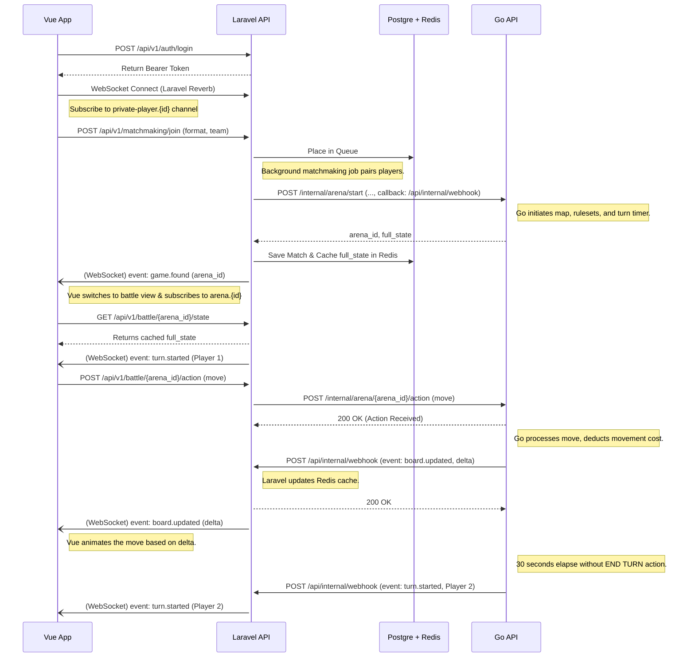

# Communication Architecture & Data Flow

## 1. System Entities
*   **Vue.js App (Client):** The frontend user interface.
*   **Laravel API (Main Backend):** Handles administrative routing, user accounts, authentication, matchmaking, persistence, and state caching. 
*   **Go API (UpsilonBattle):** The core battle engine. Handles game rules, arena state, turn timers (30s max), and combat logic.
*   **PostgreSQL (Database):** Source of truth for accounts, characters, and high-level match history.

## 2. Proxied vs. Direct Communication (Vue → Laravel → Go)

We are adhering to a **Proxied Approach** (API Gateway) where Laravel is the central hub.

### Chosen Strategy & Mitigation
*   **Centralized Authentication:** Laravel handles all user validation. The Go engine expects internally-authenticated requests from Laravel only.
*   **WebSockets via Laravel Reverb:** To solve the polling issue and maintain real-time responsiveness, Vue will open a WebSocket connection to Laravel (using Reverb) to listen for battle events (`game.started`, `turn.started`, `board.updated`, `game.ended`). Chat features can later easily piggyback on this connection.
*   **State Caching:** Laravel will maintain a cache of the current board state. When Vue needs a full refresh, it queries Laravel's cache instead of forcing Laravel to query Go. 
*   **HTTP Dual-Direction:** Laravel and Go will communicate via HTTP REST. Laravel will ping Go to create arenas or proxy actions. Go will push state changes and timed events (like a turn timeout) back to Laravel via a Webhook (Callback URL) provided at match initialization. 

---

## 3. Communication Hubs & Route Definitions

### Hub A: Vue.js ↔ Laravel API (Meta-game, Actions & State Fetching)
*Protocol: HTTP REST (JSON) + Bearer Token Auth AND WebSocket (Laravel Reverb)*

| Route            | Method | Endpoint                          | Payload (Vue → Laravel)               | Response (Laravel → Vue)                  | Intent                      |
| :--------------- | :----- | :-------------------------------- | :------------------------------------ | :---------------------------------------- | :-------------------------- |
| **Login**        | POST   | `/api/v1/auth/login`              | `{ email, password }`                 | `{ token, user }`                         | Authenticate user           |
| **Get Roster**   | GET    | `/api/v1/characters`              | -                                     | `[{ id, name, level, hp... }]`            | Fetch available characters  |
| **Queue Match**  | POST   | `/api/v1/matchmaking/join`        | `{ format: "1v1", team: [char_ids] }` | `{ status: "searching" }`                 | Enter matchmaking queue     |
| **Queue Status** | GET    | `/api/v1/matchmaking/status`      | -                                     | `{ status: "found", match_id, arena_id }` | Poll for matchmaking state  |
| **Fetch State**  | GET    | `/api/v1/battle/{arena_id}/state` | -                                     | `{ cached_board_state }`                  | Get full state (from cache) |

*WebSocket Subscriptions (Laravel → Vue via Reverb context channel `arena.{id}`):*
*   `game.started`: Arena initialized, players joining.
*   `turn.started`: A new 30s turn has begun for Player X.
*   `board.updated`: Notification that an action occurred (prompting Vue to update specific sprites or call `Fetch State` if a delta isn't enough).
*   `game.ended`: Match concluded, results are ready.
*   `(future) chat.message`: New message in arena.

### Hub B: Laravel API ↔ Go API (Battle Orchestration & Event Webhooks)
*Protocol: Internal HTTP REST (JSON) on both sides*

| Route (Target) | Method | Endpoint                      | Payload                                                         | Response                      | Intent                                                    |
| :------------- | :----- | :---------------------------- | :-------------------------------------------------------------- | :---------------------------- | :-------------------------------------------------------- |
| **Go**         | POST   | `/internal/arena/start`       | `{ match_id, players: [...], callback_url }`                    | `{ arena_id, initial_state }` | Laravel orders Go to spin up arena & gives webhook URL.   |
| **Go**         | POST   | `/internal/arena/{id}/action` | `{ player_id, type: "move", coords: {x,y} }`                    | `{ status: "accepted" }`      | Proxy an action. Go validates, then async fires callback. |
| **Laravel**    | POST   | `{callback_url}` *(Dynamic)*  | `{ match_id, event_type, player_id, entity_id, data, timeout }` | `200 OK`                      | Go pushes board updates/turn events to Laravel cache.     |

*(Note on UpsilonBattle JSON API Requirement: The Go API currently lacks an HTTP REST API, webhook outward firing mechanics, and 30s turn clocks. Building these will be a primary focus).*

---

## 4. Sequence Diagram: Basic Usecase (Proxied + WebSocket)

